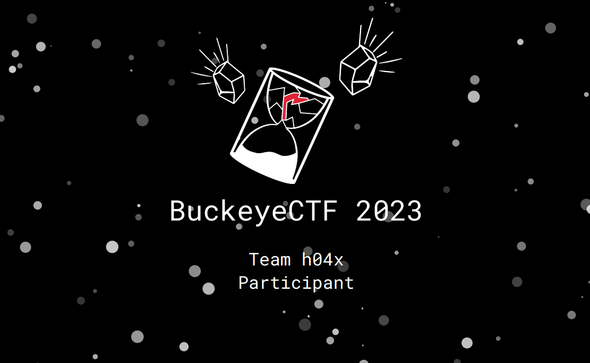

# BuckeyeCTF 2023

https://ctftime.org/event/2074

## Event Description

CTF run by students and alumni from Cyber Security Club @ Ohio State.
BuckeyeCTF is intended to be beginner-friendly and is geared towards university teams, but there will be a wide range of difficulty.
Format is jeopardy: web, reversing, binary exploitation, crypto, etc. with a focus on enjoyable problems.
Three divisions:
- Open (no team size limit)
- U.S. Undergraduate & high school (no team size limit)
- Ohio State (1-4 students)
CTF site: https://ctf.osucyber.club

## [Misc](./misc)
 * #### [Parkour](./misc/Parkour)
 * #### [replace-me](./misc/replace-me)
## [Crypto](./crypto)
 * #### [My First Hash](./crypto/My%20First%20Hash)
 * #### [Rivest-Shamir-Adleman](./crypto/Rivest-Shamir-Adleman)
 * #### [Secret Code](./crypto/Secret%20Code)
## [pwn](./pwn)
 * #### [Beginner Menu](./pwn/Beginner%20Menu)
 * #### [Starter Buffer](./pwn/Starter%20Buffer)
## [rev](./rev)
 * #### [8ball](./rev/8ball)
 * #### [Currency Converter](./rev/Currency%20Converter)
## [Web](./web)
 * #### [Triple D](./web/Triple%20D)
