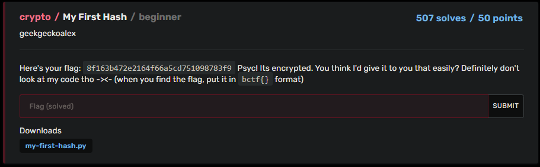

# BuckeyeCTF 2023 | Crypto | My first Hash

by h04x

### Challenge Description 



#### Decrypting the hash

Looking at the script provided in the chall we can see that the hash is a md5 hash. 
I just used hashcat to decrypt the hash.

```
hashcat -m 0 -a 0 -o cracked.txt [MD5_HASH] /usr/share/wordlists/rockyou.txt
```

[](./flag.png)

`FLAG: bctf{orchestra}`