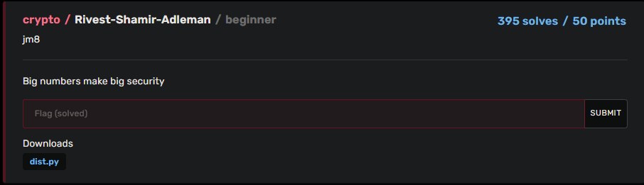

# BuckeyeCTF 2023 | Crypto | Rivest-Shamir-Adleman

by h04x

### Challenge Description 

#### Getting the flag

Looking at the titel of the chall and the provided python script we know that we probably have to decode an RSA encoded string.

Using an online decoder i get the flag

`FLAG: bctf{1_u53d_y0ur_k3y_7h4nk5}`