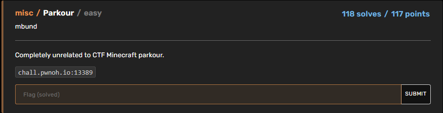

# BuckeyeCTF 2023 | Misc | Parkour

by h04x

### Challenge Description 

#### Getting the flag

Looking at the description the first thing i did was use an online tool to check if the ip is hosting a minecraft server, which was the case!
Connection to it reveals a minecraft parkour.
I just used the Wurst Minecraft Client to give me flyhacks and get the flag.

`FLAG: bctf{}`