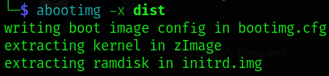
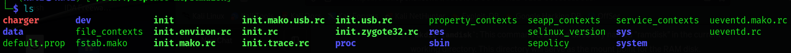
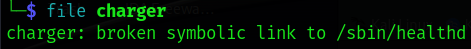
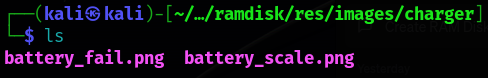

# BuckeyeCTF 2023 | Misc | replace-me

by h04x

### Challenge Description 


#### Analysing the file

Using the files command i look at what file we got provided:

```dist: Android bootimg, kernel, ramdisk, page size: 2048, cmdline (console=ttyHSL0,115200,n8 androidboot.hardware=mako lpj=67677 user_debug=31)```

Apparently it is a Android bootimg! 
Interesting. 

Using the abootimg command we can extract the components of the boot image to view them



The most interesting part about this is probably the ramdisk so we have to extract the data out of the initrd.img using this command:

```gzip -dc ../initrd.img | cpio -i```

I created a seperat "ramdisk" directory to store the data in it

Andddd now we have an extracted version of the data in the initrd.img!!

#### Looking at the filesystem

Looking at the filesystem the first thing that seems interesting is a file called "charger"



Looking at the filetype reveals this:



It's linking to the location /sbin/healthd so let's look at that one.
Looks like there's nothing really interesting there mhmm

Just looking through all the directorys i find an interesting part in the res/images folder called charger with 2 pngs inside of it



One of the pictures has the flag on it!


`FLAG: bctf{gr33n_r0b0t_ph0N3}`
