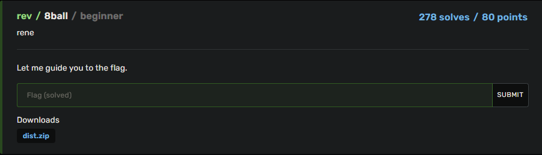

# BuckeyeCTF 2023 | rev | 8ball

by h04x

### Challenge Description 

#### Looking at the Decompiled Program

Looking at the decompiled program we can see that the program checks if we enter ./magic8ball into the terminal so the first thing i did was rename the program to magic8ball.

Also looking at the code we find out that when the compare is right and we enter ./magic8ball the program sets var_ch to 1

Later in the code we can see that when we ask the program after "flag" the code will only print out the flag if the variable var_ch is 1.

So all we have to do is change the programs name to magic8ball and then ask it after the flag.

So let's do that.

`FLAG: bctf{Aw_$hucK$_Y0ur3_m@k1Ng_m3_bLu$h}`