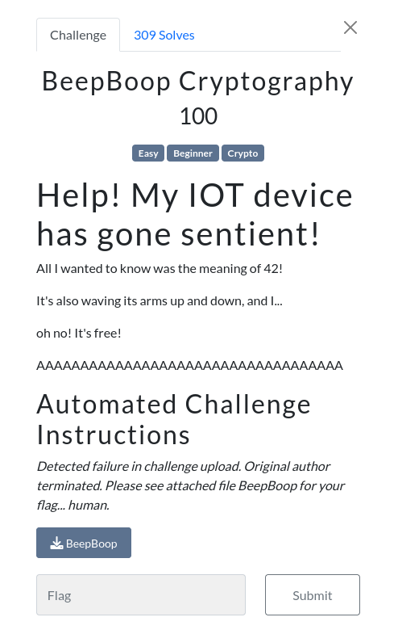
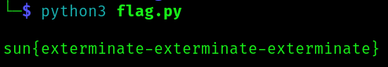

# SunshineCTF 2023 | Crypto | BeepBoop Cryptography

by h04x

### Challenge Description 

#### Looking at the provided file

We get a file full of beep's and boop's which i supposed we have to convert to binary
After translating them to Binary we get a string that looks like rot13 to me and decoding that we get the flag

I wrote a simple script that solves the chall:

[My Script](./flag.py)

`FLAG: sun{exterminate-exterminate-exterminate}`