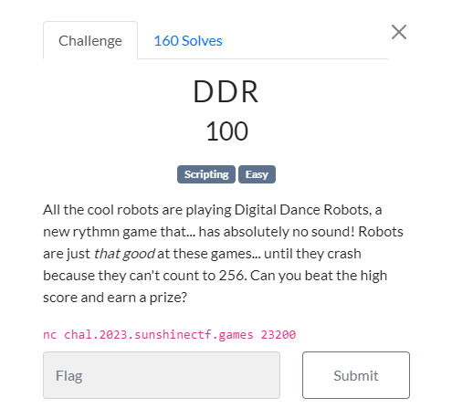

# SunshineCTF 2023 | Web | DDR

by h04x

### Challenge Description 

#### Looking at the netcat

The first thing i did was to look at the nc connection 

So the server gives us a random "string" of arrows that we then have to recreate with WASD in like 1 second.

So since the Challenge is in the scripting category i wrote a script to solve this challenge.

[My Script](./flag.py)

`FLAG: sun{d0_r0b0t5_kn0w_h0w_t0_d4nc3}`