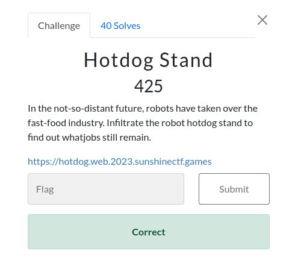
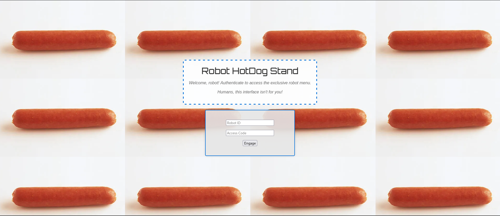
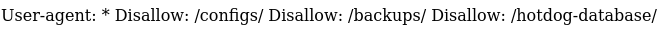
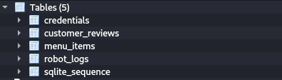
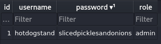
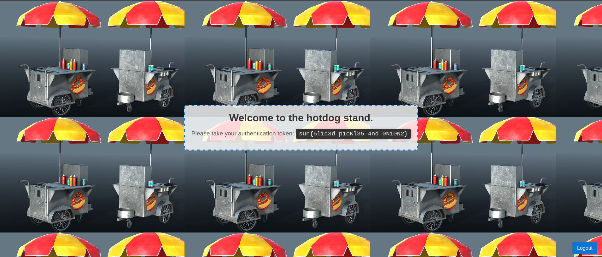

# SunshineCTF 2023 | Web | HotDog Stand

by h04x

### Challenge Description 

#### Looking at the Website

When visiting the Website we can see a log-in portal:

Following my instinct since the whole ctf is kinda build around AI/Robots i looked at the Robots.txt and look what we have here:

Only the /hotdog-database gives out something and downloads a database 

We can see that there are 5 tables but the most important one is credentials.
Inside of it is only one credential, the admin credential!

Logging in with those credentials gives us the flag

`FLAG: sun{5l1c3d_p1cKl35_4nd_0N10N2}`