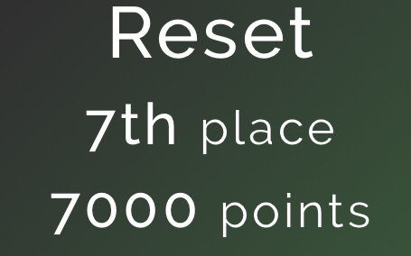

# Urmia CTF 2023

https://ctftime.org/event/2067/

## Event Description

Urmia CTF (UCTF) is a student-led cybersecurity competition organized by Urmia University and Urmia University of Technology.
This CTF is geared more towards university students, but anyone may compete!

## [Misc](./misc)
 * #### [Appellations](./misc/appelations)
 * #### [Insider's-secret](./misc/insiders-secret)
## [Reverse](./rev)
 * #### [VerySuperMario](./rev/very-super-mario)
## [Steganography](./stego)
 * #### [Dorna](./stego/dorna)

## Writeups of my Team:

[Team Writeups](https://github.com/ResetSec/UrmiaCTF/blob/main/README.md)

