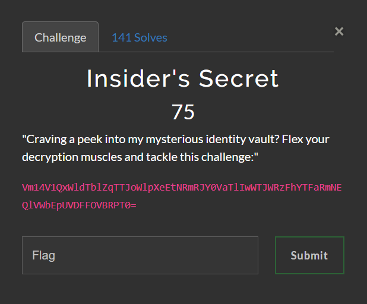
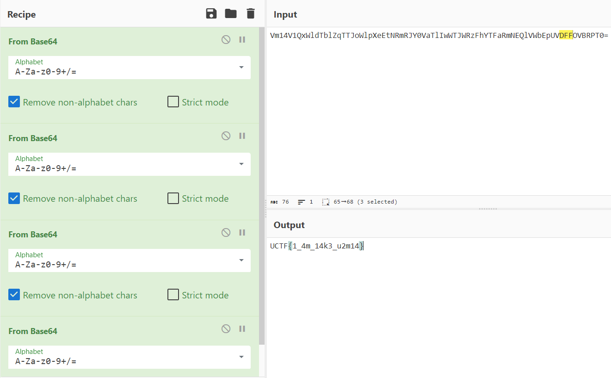

# Urima CTF | Crypto | Insider's Secret 

by h04x

### Challenge Description 



#### Analyzing the String

The String in the Description of the Chall looks like Base64 to me and using CyperChef we can decode it.

#### Decoding the String 

Using CyberChef i decoded the String and got this:

```VmxWT1ZWSnVjM2hZZWxKMFdIcEZNR0Y2VG1aa1ZFcDBUVlJTT1E9PQ==```

Another Base64 String!

#### Decoding again and again and again

After decoding the new String we get another Base64 encoded String. 
After decoding the original String 4 times we get the flag



`FLAG: UCTF{1_4m_14k3_u2m14}`
