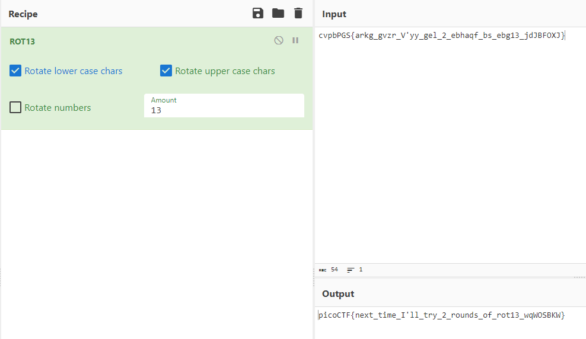

# Mod-26
## Chall Author: PANDU  

## Description

Cryptography can be easy, do you know what ROT13 is?
cvpbPGS{arkg_gvzr_V'yy_gel_2_ebhaqf_bs_ebg13_jdJBFOXJ}

## Solving

ROT13 ("rotate by 13 places") is a simple letter substitution cipher that replaces a letter with the 13th letter after it

So we just have to move every letter back 13 characters
We could do all of this manually but i will just use CyberChef

And there is the flag.

