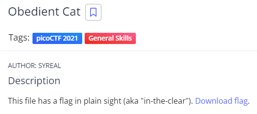
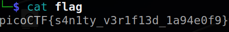

# ObedientCat
## Chall Author: SYREAL

## Description

This file has a flag in plain sight (aka "in-the-clear").
[Download Flag](./flag.txt)

## Solving

I will just try to cat the file

And there is the flag.

