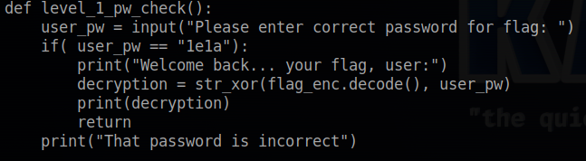

# PW Crack 1
## Chall Author: LT 'SYREAL' JONES

## Description 


Can you crack the password to get the flag?
Download the password checker [here](./level1.py) and you'll need the encrypted [flag](./level1.flag.txt.enc) in the same directory too.

## Finding the Password 

The script wants a password to decrypt the key


Looking at the python script reveals the function that comparse our input with the correct password



Luckily the password is in clear text 
So know we know that it's ```1e1a```

Running the script again and entering the password outputs the flag


## Flag 

picoCTF{545h_r1ng1ng_fa343060}
