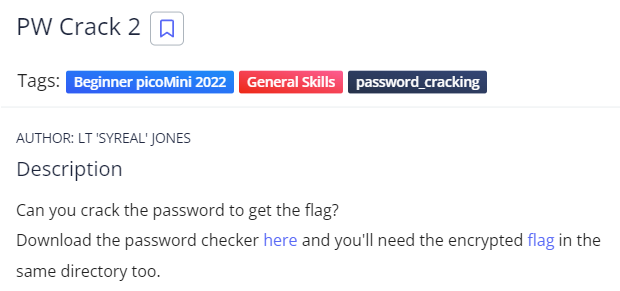
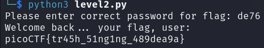

# PW Crack 2
## Chall Auth: LT 'SYREAL' JONES

## Description 



Can you crack the password to get the flag?
Download the password checker [here](./level2.py) and you'll need the [encrypted flag](./level2.flag.txt.enc) in the same directory too.

## Solving 

Looking at the python script we see this code:

```
def level_2_pw_check():
    user_pw = input("Please enter correct password for flag: ")
    if( user_pw == chr(0x64) + chr(0x65) + chr(0x37) + chr(0x36) ):
        print("Welcome back... your flag, user:")
        decryption = str_xor(flag_enc.decode(), user_pw)
        print(decryption)
        return
    print("That password is incorrect")
```

We can see that our input gets compared to a hex encoded password

```
if( user_pw == chr(0x64) + chr(0x65) + chr(0x37) + chr(0x36) )
```

Now we just have to decode these characters and we get 

de76

Entering this into the script we get our flag:



## Flag

picoCTF{tr45h_51ng1ng_489dea9a}
