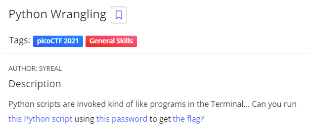
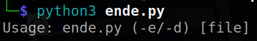
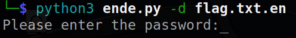
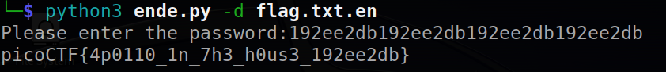

# Python Wrangling
## Chall Author: SYREAL

## Description

Python scripts are invoked kind of like programs in the Terminal... Can you run [this python script](./ende.py) using [this password](./pw.txt) to get the [flag](./flag.txt.en)?

## Solving

Trying to run the script gives me this output.
-e/-d probably stand for encrypt and decrypt and the [file] is asking for the file we want to en-/decrypt.

Trying to decrypt the flag.txt.en gives me this output

I enter the password given in the pw.txt file

And there we have the flag.

