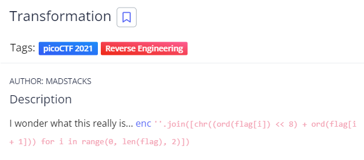
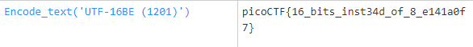

# Transformation
## Chall Auth: MADSTACKS

## Description 



I wonder what this really is... [enc](./enc) ''.join([chr((ord(flag[i]) << 8) + ord(flag[i + 1])) for i in range(0, len(flag), 2)])

## Solving

Inside the enc file there is this:
```灩捯䍔䙻ㄶ形楴獟楮獴㌴摟潦弸強㕤㐸㤸扽```

I will simply run it through CyberChef's "Magic" option and Bamm



There is our flag.

## Flag 

picoCTF{16_bits_inst34d_of_8_e141a0f7}
