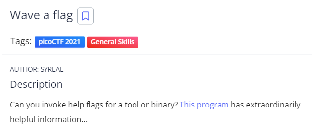
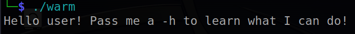
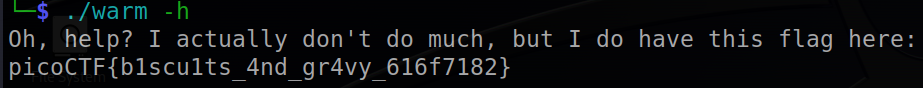

# Wave a Flag
## Chall Auth: SYREAL

## Description



Can you invoke help flags for a tool or binary? [This program](./warm) has extraordinarily helpful information...

## Solving

First i'll try to run the file since it's an ELF



Now I'll try to run the same command with the ```-h``` option that usually print more information about the usage of a file/comman



And there is the flag


