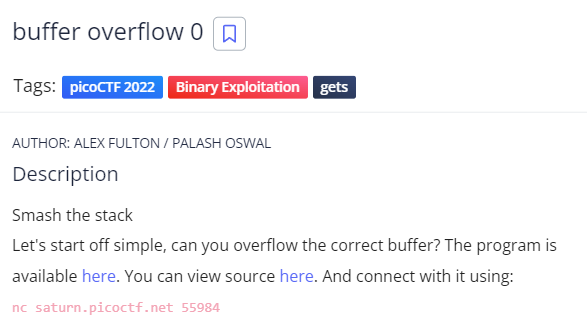
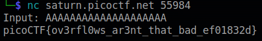

# buffer overflow 0
## Chall Author: ALEX FULTON / PALASH OSWAL

## Description

Smash the stack
Let's start off simple, can you overflow the correct buffer? The program is available [here](./vuln). You can view source [here](./vuln.c). And connect with it using:
nc saturn.picoctf.net 55984

## Exploitation

As the titel of the challenges indicates we probably have to exploit a buffer overflow vulnerability that's why i will skip the, running the file, phase and immediately try to exploit it with easy buffer overflows

And there is our flag

## Flag

picoCTF{ov3rfl0ws_ar3nt_that_bad_ef01832d}
