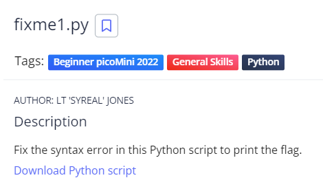
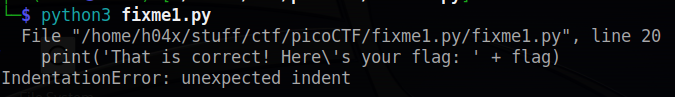
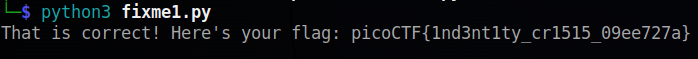

# fixme1.py
## Chall Author: LT 'SYREAL' JONES

## Description 



Fix the syntax error in this Python script to print the flag.
[Download Python Script](./fixme1.py)

## Fixing the error



The error tells us that there are more whitespaces than there should be 
```
flag = str_xor(flag_enc, 'enkidu')
  print('That is correct! Here\'s your flag: ' + flag)
```
There are too many whitespaces before the print, so let's fix that
```
flag = str_xor(flag_enc, 'enkidu')
print('That is correct! Here\'s your flag: ' + flag)
```
And running this fixed script prints out our flag



## Flag

picoCTF{1nd3nt1ty_cr1515_09ee727a}
