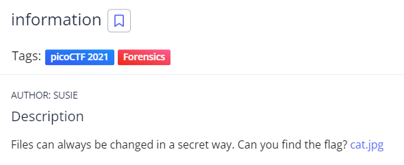
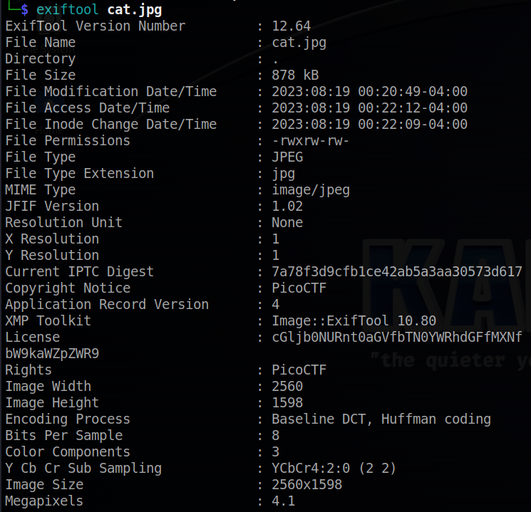
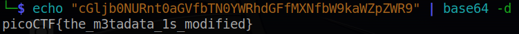

# information
## Chall Auth: SUSIE

## Description

Files can always be changed in a secret way. Can you find the flag? [cat.jpg](./cat.jpg)

## Solving

The first thing i will do is check the files information with exiftool

The license string seems to be base64 encoded, so let's decode it!

And there is the flag.

