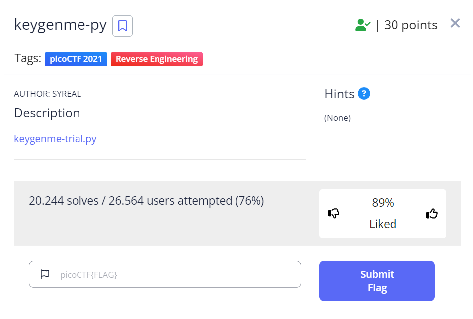

# PicoCTF | Reverse Engineering | keygenme.py 

## Challenge Description



[keygenme-trail.py](keygenme-trial.py)

## Running the Script

When running the script it gives us a prompt, asking us which option of the "Arcane Calculator" we want to use.
Only the "Enter License Key" seems interesting to me

## Looking  at the Code

The first thing i notice that the key is apparently generated in the script 
```
key_part_static1_trial = "picoCTF{1n_7h3_|<3y_of_"
key_part_dynamic1_trial = "xxxxxxxx"
key_part_static2_trial = "}"
key_full_template_trial = key_part_static1_trial + key_part_dynamic1_trial + key_part_static2_trial
```
Both static parts are already give, so we only have to figure out where and how the dynamic part is getting generated!

Looking at what happens when we enter c (Enter License Key) is that the enter_license() function is getting called.
the enter_license() function only gets our license key input and then assigns it to a user_key.
after that it start a new function called check_key which is probably the one we have to find the vulnerability/dynamic part in.

## Looking at the check_key function

The function just checks if the first part of our input matches the static license key and then after that the dynamic part gets checked:

```
if key[i] != hashlib.sha256(username_trial).hexdigest()[4]:
            return False
        else:
            i += 1

if key[i] != hashlib.sha256(username_trial).hexdigest()[5]:
        return False
else:
        i += 1

if key[i] != hashlib.sha256(username_trial).hexdigest()[3]:
        return False
else:
        i += 1

if key[i] != hashlib.sha256(username_trial).hexdigest()[6]:
        return False
else:
        i += 1

if key[i] != hashlib.sha256(username_trial).hexdigest()[2]:
        return False
else:
        i += 1

if key[i] != hashlib.sha256(username_trial).hexdigest()[7]:
        return False
else:
        i += 1

if key[i] != hashlib.sha256(username_trial).hexdigest()[1]:
        return False
 else:
        i += 1

if key[i] != hashlib.sha256(username_trial).hexdigest()[8]:
        return False
```
The function basically checks every character after the first static key part one by one and compares it to something, after that it checks the next character and so on.

Now we have to look at what values get compared to our input:

```
key[i] != hashlib.sha256(username_trial).hexdigest()[8]
```
## Getting the flag

The first thing this part of the code does, is that it hashes username_trial with sha256 and then takes this hash and compares the 9th character of it to our input!
So all we have to do is find the value of username_trial, hash it and then look at what characters are at the index we need.

To automate that i wrote this little [python script](./solution.py)

And that way we get the flag!


