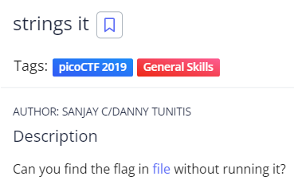

# strings it
## Chall Auth: SANJAY C/DANNY TUNITIS

## Description



Can you find the flag in [file](./flag) without running it?

## Solving 

As the titel already implements i'm going to check the binary using the ```strings``` command and grep the flag.


## Flag 

picoCTF{5tRIng5_1T_d66c7bb7}
