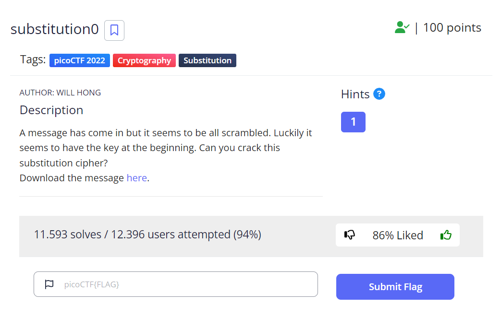
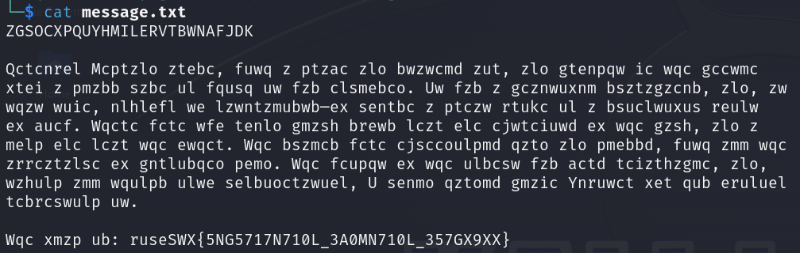
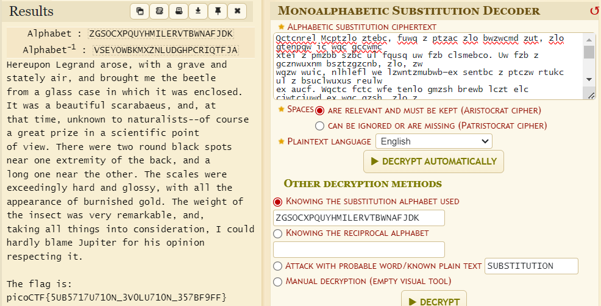

# PicoCTF | Crypto | Substitution0

by h04x

### Challenge Description 

Needed File:

[message.txt](./message.txt)

### Looking at the file 

Looking at the file displays this:

We can see that at the top of the file there's one long string of capital letters sticking out from the rest of the message.
The other part of the file just looks like words encrypted.
The first thing that comes to my mind is a [Mono-alphabetic Substitution](https://www.101computing.net/mono-alphabetic-substitution-cipher/).
 
### Getting the Flag

Using an online tool we decode the message and get our flag:

