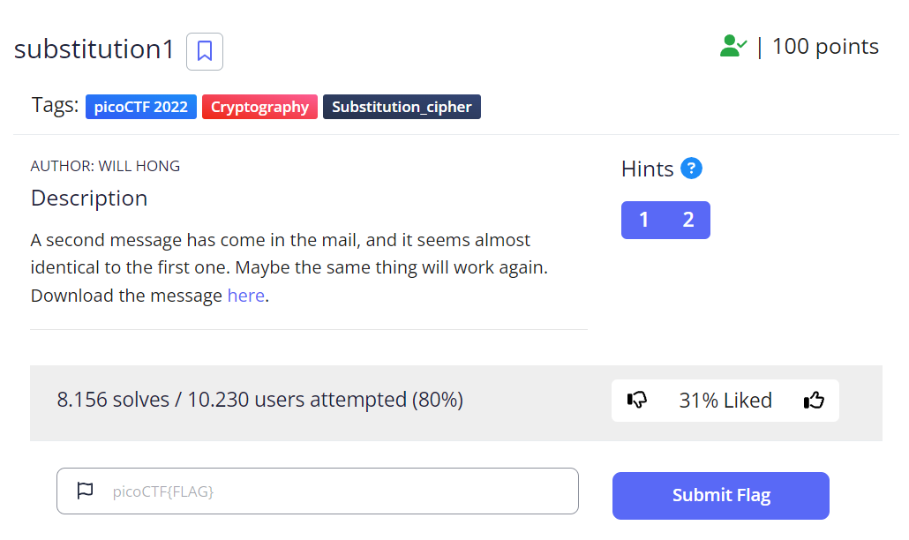
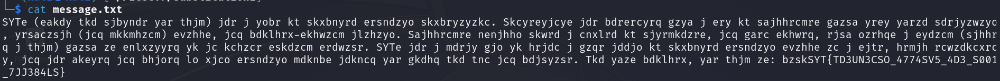
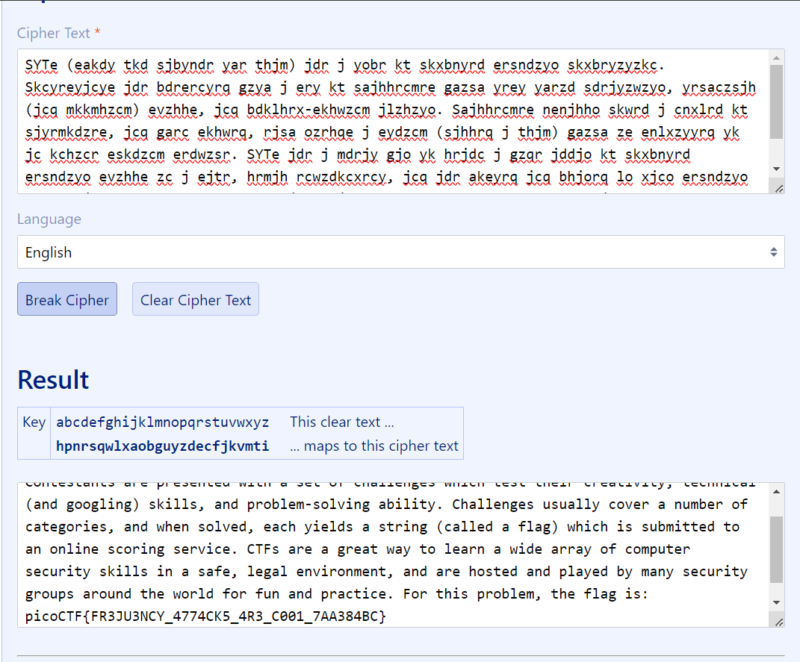

# PicoCTF | Crypto | Substitution1

by h04x

## Challenge Description 

Needed File:

[message.txt](./message.txt)

## Looking at the file 

Looking at the file displays this:

This time we don't have a string of letters we could use but we could just try a frequency attack! 
 
## Getting the Flag

Using [this](https://www.guballa.de/substitution-solver) online tool we decode the message and get our flag:

